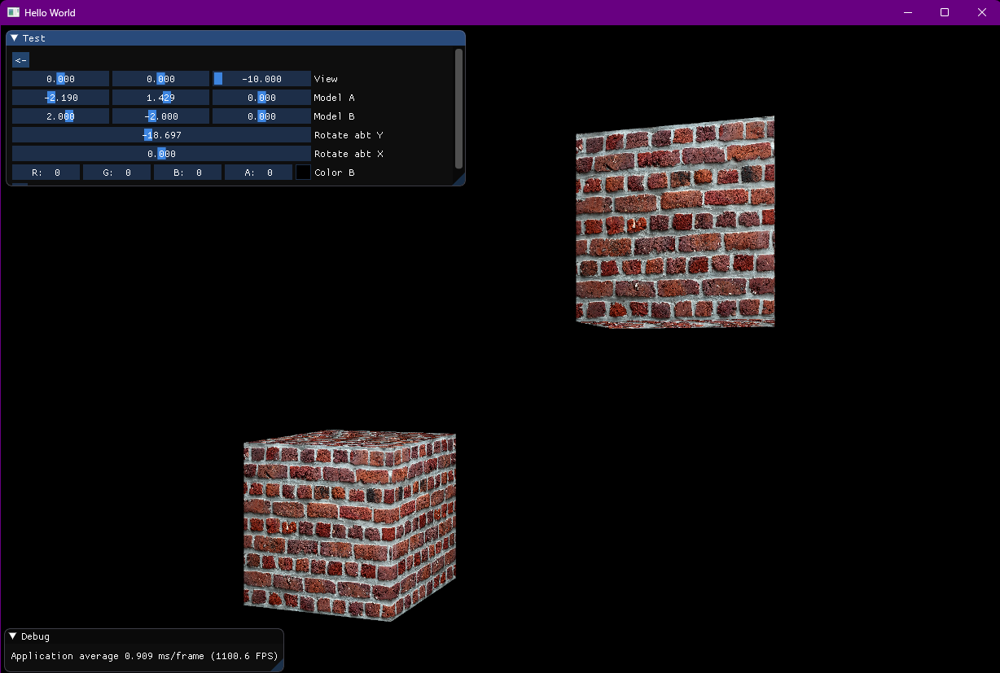
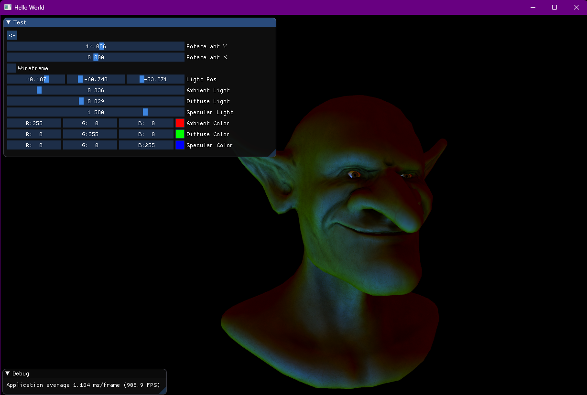
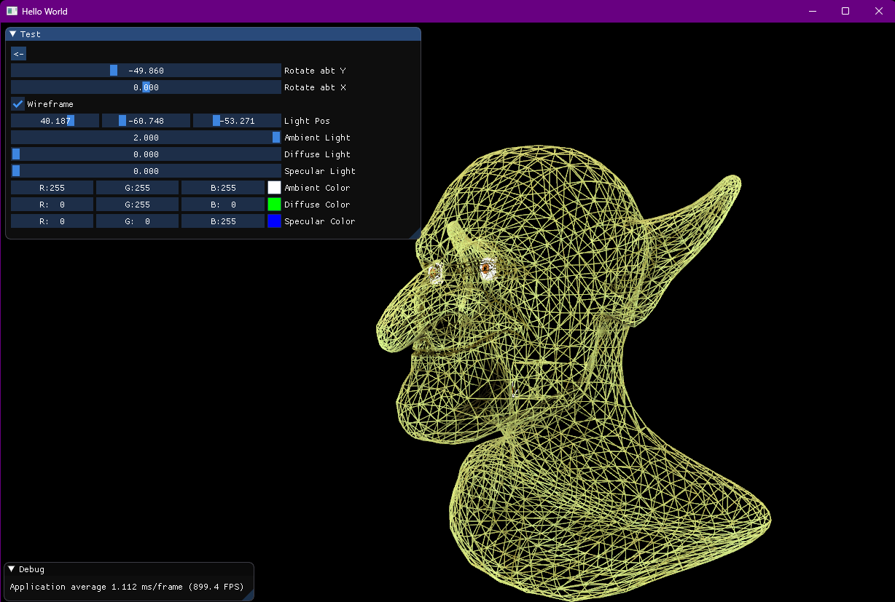
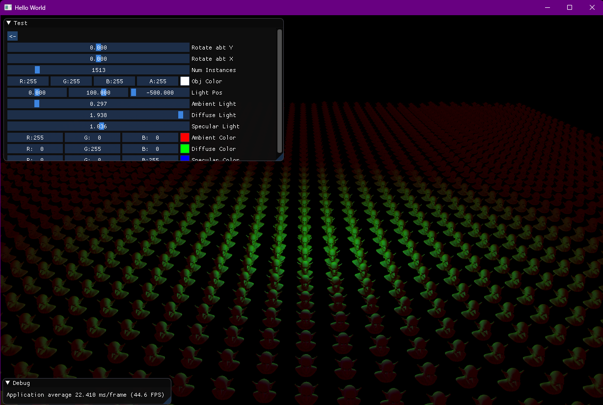
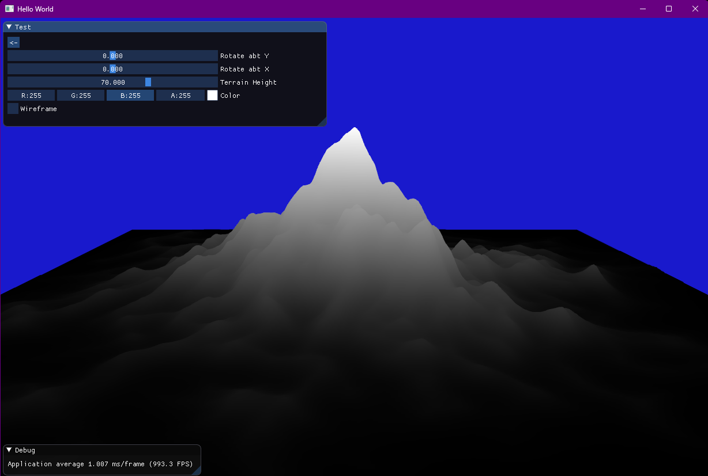
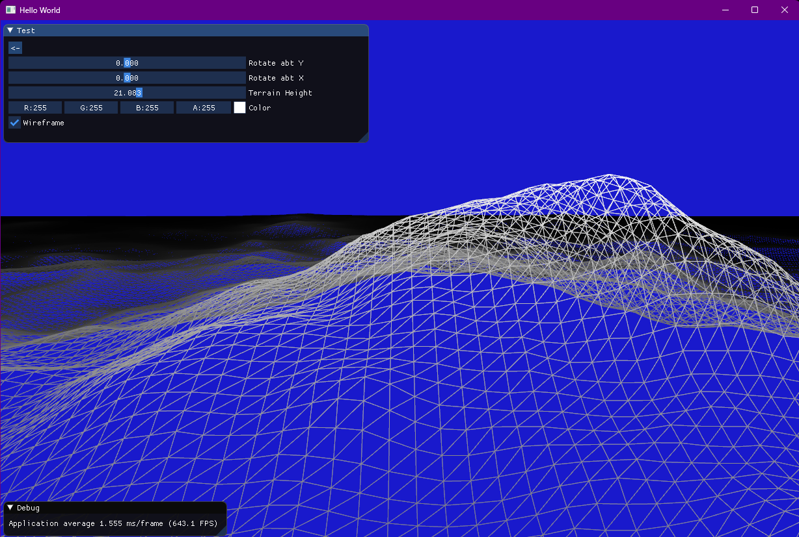
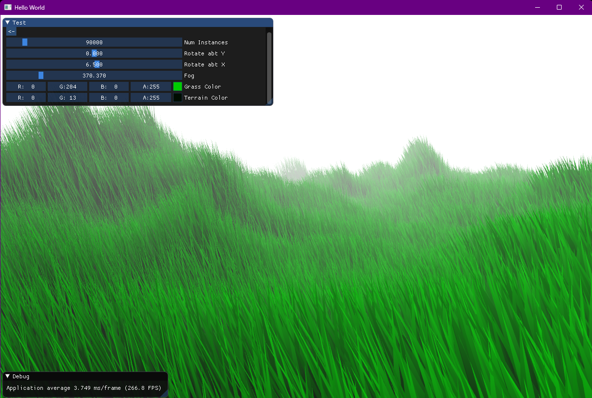
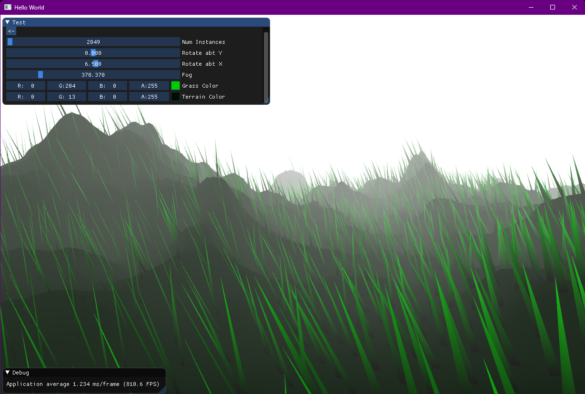
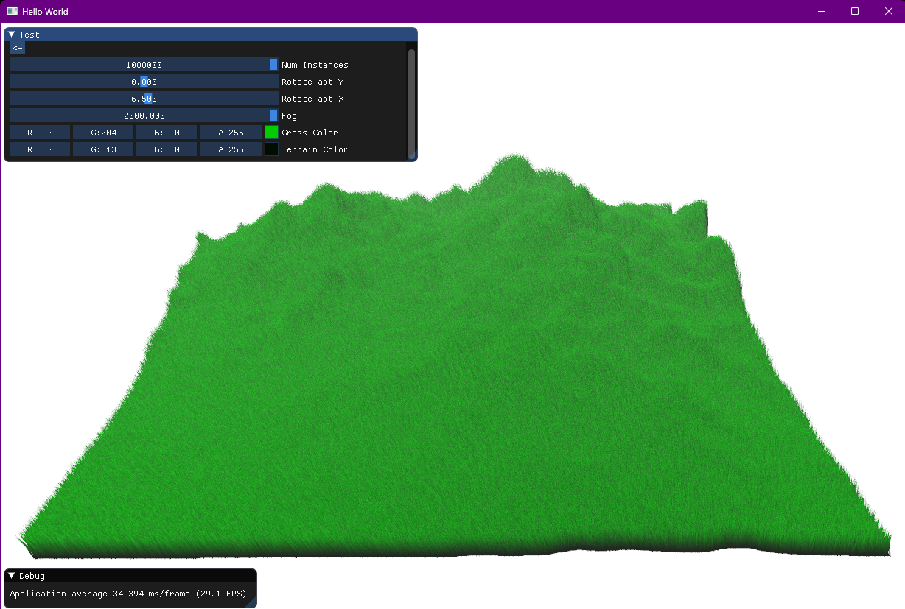

# OpenGL Demos

Demos of various rendering/graphics techniques with OpenGL. Basically a framework I use to teach myself OpenGL techniques with little demos of each thingamabob. Started off from @TheCherno OpenGl tutorial series, then applied it to 3D graphics extending the framework.

## Basic 3D Render

First I manually loaded in the vertices of a cube to get my first 3D render. Applied textures, and made two adjustable cubes via model transformation matrices.

## Model (.obj) Loading with Phong Shading

Next I implemented a very simple .obj loader, can apply texture as well but has to be loaded separately. Implemented lighting in the shader with phong shading and added ImGui contols for playing with different light colours and instensities.

Model by Willy Decarpentrie (https://sketchfab.com/skudgee)

## Instancing

Using same model as before, I tried instanced rendering. The grid layout is done in the vertex shader using instanceIDs, and the grid size adjusts with the number of instances. Lighting calculations applied after relocating vertices. ImGui panel allows you to adjust number of instances, as well as light position and parameters.

## Terrain

Simple terrain render using a heightmap. Wrote a class for generating a grid of vertices and then map vertex heights based on heightmap loaded as texture. Uses an adjustable paramater for the factor by which the heightmap is applied.

The heightmap itself (as well as the one used for the grass rendering) was stolen from this tutorial: http://voxels.blogspot.com/2014/01/procedural-terrain-heightmap-generation.html

## Grass

Combining instancing with terrain, I made a simple scene with grass waving in the wind. Each grass blade comes from a very simple .obj model I made, and for animation I applied some pseudo-random sine waves based on the heights of vertices within their respective grass blades. Also added adjustable fog using the depth buffer.

Rendering a million instances in this example, and running just under 30 fps on my old gaming laptop.

